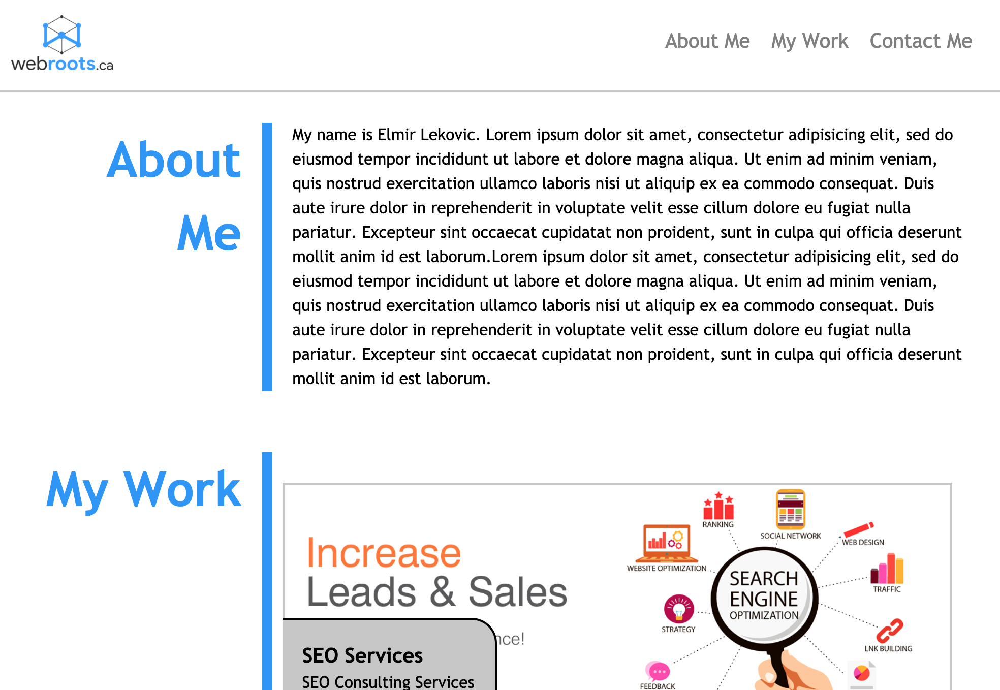

# portfolio
Portfolio app displaying my work and applications

This portfolio website is following mobile first design
- It has two views small and large. The view changes at min-width: 768px
- It contains work that I have done up until now and work that I will be doing in the future.
- It contains 4 sections:
    - Navigation 
    - About Me
    - My Work 
    - Contact Me

Navigation:
you can navigate this page using the menu at the top right. 

About Me section:
The "About Me" section contains brief bio about me. It contains some history about how and why have decided to be a full stack developer.

"My Work" section:
The "My Work" section is setup in such way that:
Clicking on the image will take you to the application on github.

"Contact Me" section:
You can find my contact inforamtion at the bottom of the page or use the navigation link "Contact Me" to view my contact information.

<!-- To Do add screen shot here: -->
The following image demonstrates the web application's appearance:

To Do After Javascript Leassons:
- animate the scroll on the page
- use fixed menu instead
- highlight viewing section

To view my porfolio website please use this link:
https://elmir123.github.io/portfolio/.

